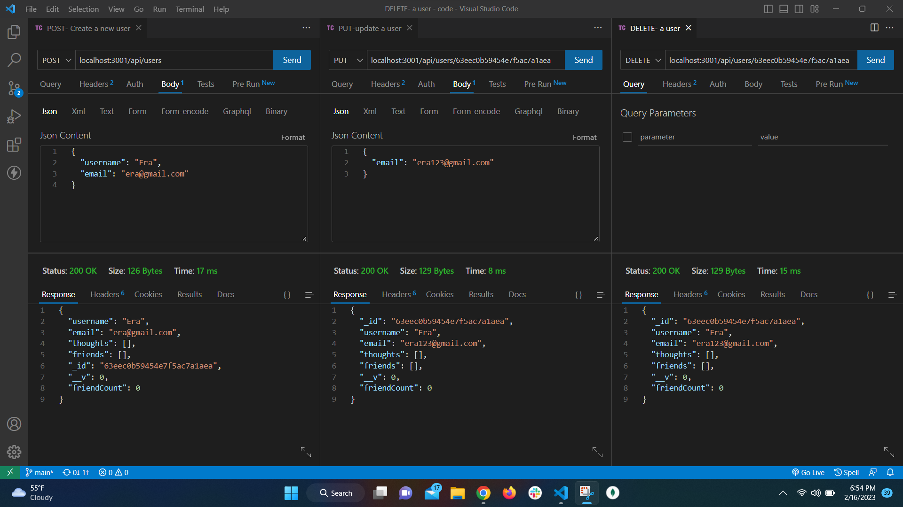
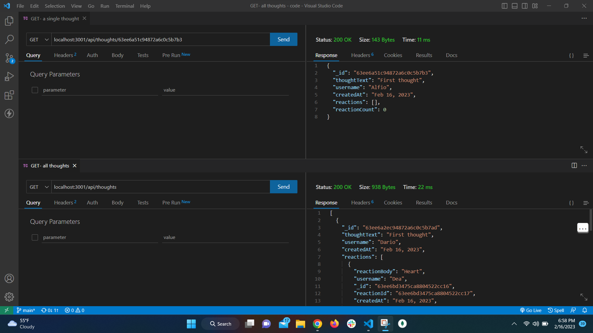
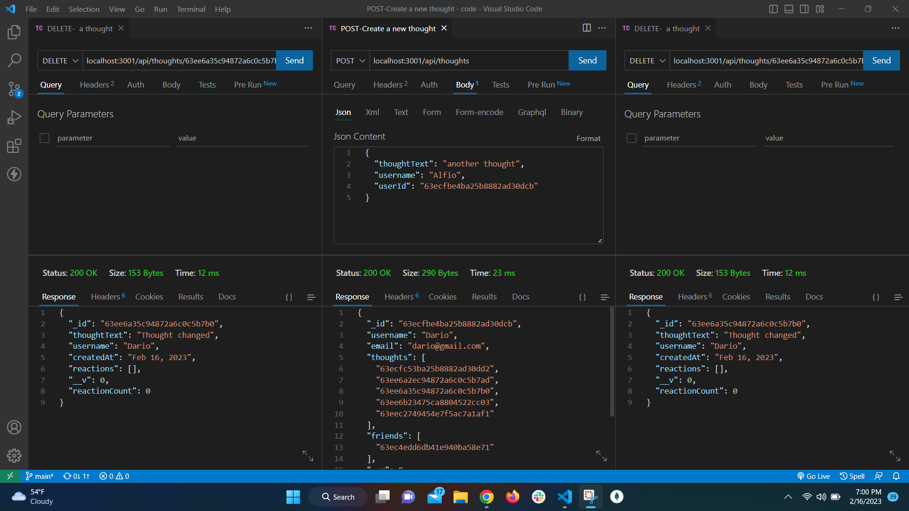
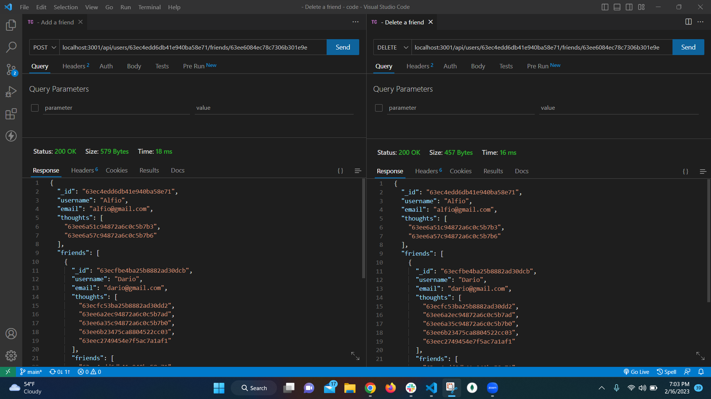
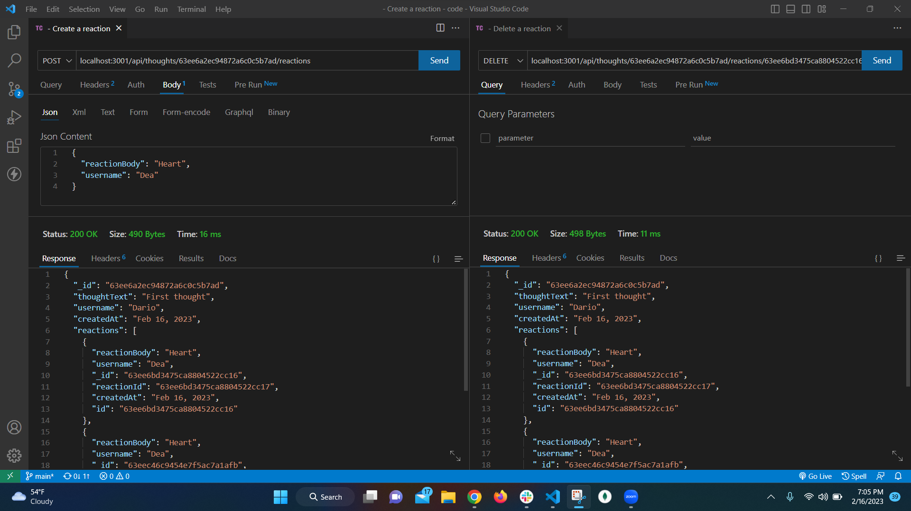

# So Net Api

   
  ## Table of Contents
  - [Description](#description)
  - [Installation](#installation)
  - [Usage](#usage)
  - [Questions](#Questions)
  

  ## Description
  🔍This is an back end for an e-commerce site that provide a suite of services to internet retail company. Application use an Express.js server and a SQL database using Sequelize. Use Thunder Client in order to make requests to the APIs.

  
  ## Installation
  💾 Run npm install in order to install the following npm package dependencies.     

  
  ## Usage

  💻  Users GET all and GET one
    
  
  💻  Users POST, PUT and DELETE
    

  💻  Thought GET all and GET one
    

  💻  Thought POST, PUT and DELETE
    

  💻  Friends POST and DELETE
    

  💻  Reaction POST and DELETE
    

  💻Walkthrough [video](https://drive.google.com/file/d/1cxyoFb5vZFAPw4ii9sAQYXPE68xKy0wX/view) 
    

  ## License 
  
    
     
  ## Questions
  ✋ Feel free to contact me for any questions: 
  
  ✉️ Email me with any questions: [alkida.vaci@gmail.com](alkida.vaci@gmail.com) 
  :octocat: Find me on GitHub: [alkidavaci](https://github.com/alkidavaci)